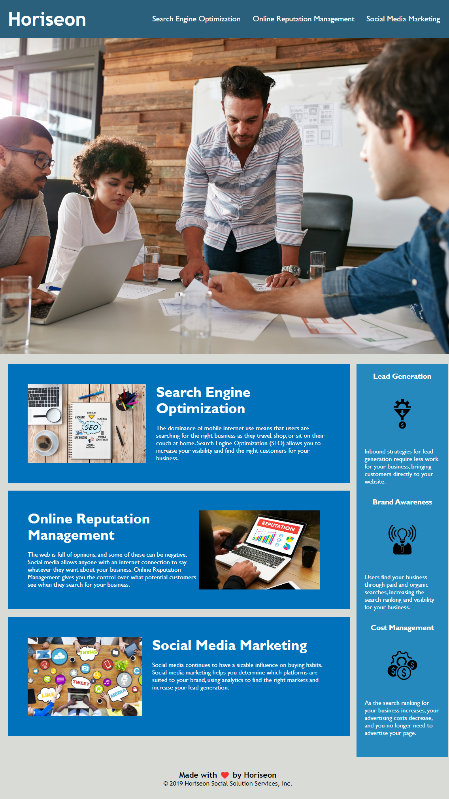

# Horiseon Challenge

# Index.html changes/fix
Changes all the 
 to their proper Syntax
a <brchanges some of class to .benefit
 added Alt="" to all the images
 added title Horiseon in <title>
 fixed Search Engine Optimization so when clicked sends you to that section on the page
 added <a> href="/" </a> to Horiseon header so now when you click it, it sends you to the home page
# Index.html removed
.benefit-lead
 .benefit-cost
 .benefit-brand

# Sytle.css changes
.benefit-lead to .benefit
# Website links
https://lucasr0609.github.io/Horiseon-Challenge/
 https://github.com/Lucasr0609/Horiseon-Challenge
# You can click on the Image to send you to the website
  

 
